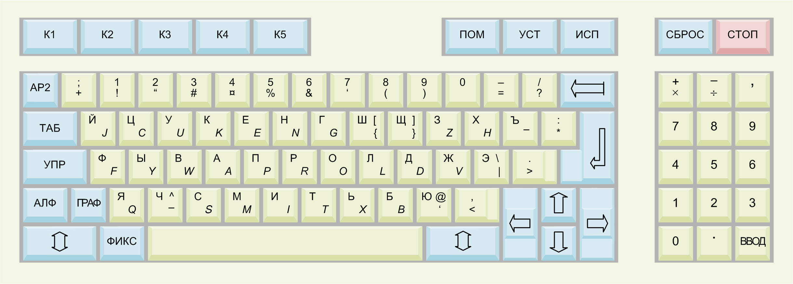
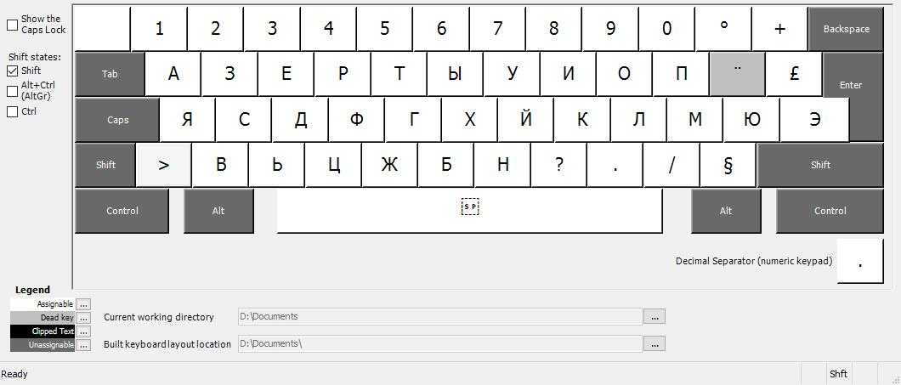
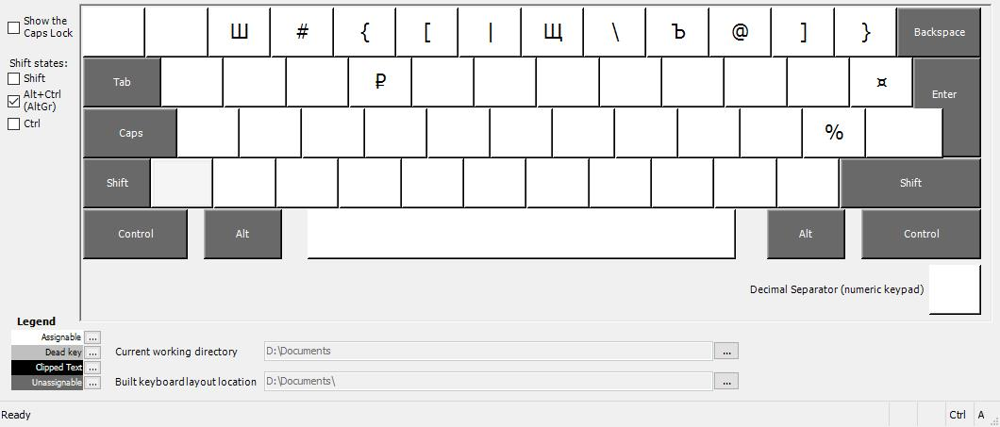

АЗЕРТЫ
======

A russian phonetic layout for french AZERTY layout. This layout is based on the famous ЙЦУКЕН (JCUKEN) layout.

Notes
=====

Please note that some symbols are placed in the numbers line, this is the case of `Ш`, `Щ` and `Ъ`. Shift still makes numbers so to make the capital of these letters, please use `Alt Gr`.

Some symbols are completely removed, because russian alphabet has more letters than french, but I removed only symboles unused in russian: `é`, `è`, `ç`, `à`, `~`, \`, `^`, `ù`.

I needed `%` for the capital `Ю` so it's now on the same key but with Alt Gr

Also as `à` isn't used in russian I replaced it by `ë`, but you can't do the capital because `Alt Gr + à` is `@`, and I wanted to keep it. If you want to do the capital `ë` please use the classic method of `¨` then `Shift + E`

This layout is based on the classic ЙЦУКЕН layout, so all the letters ou see on the picture here correspond (the `J` on AZERTY makes a `Й`, the `C` makes a `Ц`...)

Installation
============

## Setup (recommended)

Take one of the .zip files from the releases, extract it and run the `setup.exe`

## Build

Open the .klc file in the Keyboard Layout Creator, go to `Project` > `Build DLL and Setup Package` then run the `setup.exe`

Screenshots
===========

